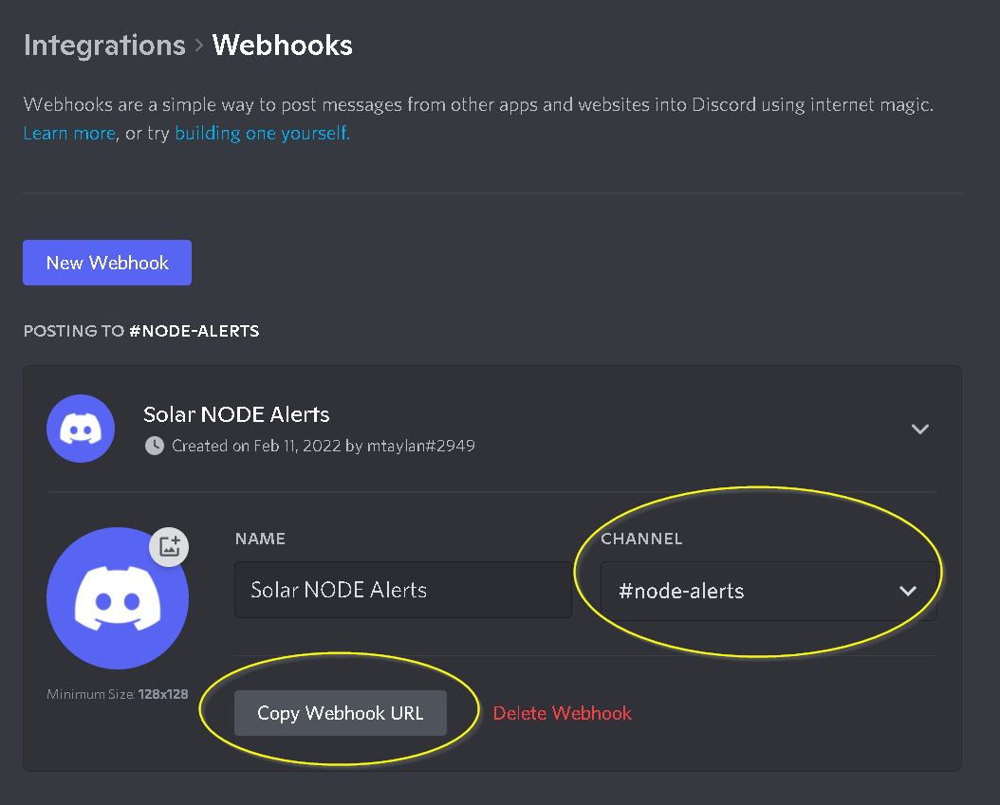

# NodeMonitoring

Scripts for monitoring your DPoS nodes and sending alarm messages via Discord webhook or Telegram bot. Forked from the adaptation of Solar block producer [mtaylan](https://github.com/mtaylan).

## Contents

- [Introduction](#introduction)
- [Installation (Telegram)](#installation-telegram)
- [Installation (Discord)](#installation-discord)
- [Extra information](#extra-information)

## Introduction

A script for monitoring your DPoS nodes and sending alarm messages via Discord or Telegram. Block producers can use this script for monitoring;

- If the DPoS node is not listed in peers list;
- If the DPoS node latency is higher than defined latency value;
- If the DPoS node blockheight is behind the defined limit for the network blockheight;
- If the DPoS node software is outdated and a newer version is available at GitHub;
- If the DPoS node HDD capacity is lower than defined critical limit;
- If the DPoS node CPU usage is higher than defined critical limit.

The script may periodically send a message that your DPoS node is alive/running.
The script sends alarm messages for the conditions listed above and also sends messages when the issue is resolved.

[Back to top](#Contents)

## Installation (Telegram)

Installation consists of two parts:

- [1] creating your own Telegram bot with dedicated channel;
- [2] setting up the monitoring script on your DPoS node server.

### Part 1: Telegram bot with dedicated channel

Create a Telegram bot and channel to post notifications in:

- [a] Visit [Botfather](https://t.me/botfather) and open the `Botfather` channel in Telegram;

- [b] Click `Start` (or `Restart` if you ever used it before):


- [c] Click or type `/newbot` to start the process of creating a new bot:


- [d] Type a fitting `(display) name` and `username` for your new bot:


- [e] Copy the `HTTP API token` and keep it safe, as this will be used in the Telegram script:


- [f] Create a new Telegram chat group by clicking `Menu`, `New Group` and choosing a name for the group, then click `Next`. Add the bot by looking up its username [in this case, the username I set was `testbfxmonitorbot`], then click `Create`:


- [g] Open the `Group` you just created and click its name to open `Group info`. Right-click the bot and choose `Promote to admin` and click `Save`, so it has access to messages:


- [h] Send a message (can contain anything) to the group with the bot. Then visit the following URL, replacing `<token>` with the token you saved earlier from step **[e]**:

```
https://api.telegram.org/bot<token>/getUpdates
```

- [i] Look for `"chat":` and then `"id":`. Copy the negative number behind `"id":` and keep it safe, as this will be used in the Telegram script:

```
        "chat": {
          "id": -714850264,
```

- You should now have a bot token from step **[e]** and chat ID from step **[i]**. Keep these safe. You can close Telegram for now and continue on your DPoS node server.

### Part 2: Setting up the monitoring script on your DPoS node server

1. Clone the repository into your DPoS node server:

```
git clone https://github.com/Bx64/NodeMonitoring.git
```

2. Edit 'Custom variables' in `dpos_node_telegram.conf`. You should **at least** change the values of `DPOS_NODE_IP`, `HOSTNAME`, `API_PORT`, `TOKEN` and `CHAT_ID`. You can choose which process you want monitored under `# Process check` by setting `true` or `false`.

```
cd NodeMonitoring
```
```
nano dpos_node_telegram.conf
```
```
# Custom variables start
#

# DPoS Node settings
DPOS_NODE_IP=xxx.xxx.xxx.xxx
HOSTNAME="hostname or description"
API_PORT=1-65535
LOOPBACK=127.0.0.1

# Process check
RELAY=true
PRODUCER=true
CORE=false

# Telegram bot settings
TOKEN=59999999999:AAAAAAAAAAAAAAAAAAk
CHAT_ID=9999999999
TELEGRAM_URL="https://api.telegram.org/bot$TOKEN/sendMessage"

# Alarm settings
SEND_ALERT_FLAG_API=true
SEND_ALERT_FLAG_CLI1=true
SEND_ALERT_FLAG_CLI2=true
SEND_ALERT_FLAG_CLI3=true
SEND_ALERT_FLAG_SW=true
SEND_ALERT_FLAG_CPU=true
SEND_ALERT_FLAG_HDD=true
SEND_ALERT_FLAG_BLOCKS=true

# Alarm threshold settings
CPU_LOAD_CRITICAL=40.00
LATENCY_CRITICAL=500
ALIVE=`date +%M`
HDD_USE_CRITICAL=95
MAX_BLOCKS_BEHIND=5

# Temporary files
FILE_API=/tmp/check_DPOS_Node_API_telegram
FILE_CLI1=/tmp/check_DPOS_Node_CLI1_telegram
FILE_CLI2=/tmp/check_DPOS_Node_CLI2_telegram
FILE_CLI3=/tmp/check_DPOS_Node_CLI3_telegram
FILE_CPU=/tmp/check_DPOS_Node_CPU_discord
FILE_SW=/tmp/check_DPOS_Node_SW_telegram
FILE_HDD=/tmp/check_DPOS_Node_HDD_telegram
FILE_BLOCKS=/tmp/check_DPOS_Node_Blocks_telegram

# Custom variables end
#
```
```
Save and exit (CTRL+X / Y / ENTER)
```

3. Install the required `sar` and `jq` packages for the monitor script:

```
sudo apt install sysstat && sudo apt-get install jq -y
```

4. Make the monitoring script executable with one of the following commands:

*- In case you are using ARK:*
```
chmod +x ark_mon_telegram.sh
```
*- In case you are using SXP:*
```
chmod +x solar_mon_telegram.sh
```

5. Use one of the following commands to test your monitor script integration, you should receive a test message at your Telegram channel:

*- In case you are using ARK:*
```
./ark_mon_telegram.sh test
```
*- In case you are using SXP:*
```
./solar_mon_telegram.sh test
```

6. Open your crontab: 

```
EDITOR=nano crontab -e
``` 

And paste one of the following sets of three lines at the bottom, to monitor your node every 1 minute, and to remove the logs once per day. The output of each run will be appended to the logfile each time so you do not lose any information on subsequent runs. Alternatively, you can choose a different timing for each of the commands (check [crontab.guru](crontab.guru)).

*- In case you are using ARK:*
```
PATH="/usr/local/sbin:/usr/local/bin:/usr/sbin:/usr/bin:/sbin:/bin:/usr/games:/usr/local/games"
*/1 * * * * ~/NodeMonitoring/ark_mon_telegram.sh >> ~/NodeMonitoring/ark_mon_telegram.log 2>&1
0 0 * * * cd ~/NodeMonitoring && rm ark_mon_telegram.log 2>&1
```
*- In case you are using SXP:*
```
PATH="/usr/local/sbin:/usr/local/bin:/usr/sbin:/usr/bin:/sbin:/bin:/usr/games:/usr/local/games"
*/1 * * * * ~/NodeMonitoring/solar_mon_telegram.sh >> ~/NodeMonitoring/solar_mon_telegram.log 2>&1
0 0 * * * cd ~/NodeMonitoring && rm solar_mon_telegram.log 2>&1
```

Save and exit (CTRL+X / Y / ENTER). Now you are all set!

[Back to top](#Contents)

## Installation (Discord)

Installation consists of two parts:

- [1] creating your own Discord webhook with dedicated channel;
- [2] setting up the monitoring script on your DPoS node server.

### Part 1: Discord webhook with dedicated channel

Create a Discord server with dedicated channel for the bot using a webhook:

- [a] Login to Discord (or register for a new user);

- [b] Create your own server;

- [c] Open your 'Server settings' and head into the 'Integrations' tab;

- [d] Click the “Create Webhook” button to create a new webhook;


- [e] You’ll have a few options here. You can:
    - Edit the avatar by clicking the avatar next to the Name in the top left;
    - Choose what channel the Webhook posts to: By selecting the desired text channel in the  dropdown menu.

- [f] You now have your own webhook URL that you can link to more websites to receive messages from.


- [g] Get the webhook URL for the server/channel you want to receive messages:
    - As an example, we've created a text channel labeled '#node-alerts' and the webhook is used for dpos_mon_discord.sh to post messages here;
    - Copy the webhook URL for this channel by pressing the copy webhook URL button. Keep this safe.



- [h] You should now have the bot in your own server and a webhook URL from step **[g]** copied to a safe place. You can close Discord for now and continue on your DPoS node server.

### Part 2: Setting up the monitoring script on your DPoS node server

1. Clone the repository into your DPoS node server:

```
git clone https://github.com/Bx64/NodeMonitoring.git
```

2. Edit 'Custom variables' in `dpos_node_discord.conf`. You should **at least** change the values of `DPOS_NODE_IP`, `HOSTNAME` and `API_PORT`. You can choose which process you want monitored under `# Process check` by setting `true` or `false`. If you did not clone the repository in your home directory, make sure to also change `DISCORD` and line 13 in the monitoring script.

```
cd NodeMonitoring
```
```
nano dpos_node_discord.conf
```
```
# Custom variables start
#

# DPoS Node settings
DPOS_NODE_IP=xxx.xxx.xxx.xxx
HOSTNAME="hostname or description"
API_PORT=1-65535
LOOPBACK=127.0.0.1

# Process check
RELAY=true
PRODUCER=true
CORE=false

# Discord script settings
DISCORD=~/NodeMonitoring/discord.sh

# Alarm settings
SEND_ALERT_FLAG_API=true
SEND_ALERT_FLAG_CLI1=true
SEND_ALERT_FLAG_CLI2=true
SEND_ALERT_FLAG_CLI3=true
SEND_ALERT_FLAG_SW=true
SEND_ALERT_FLAG_CPU=true
SEND_ALERT_FLAG_HDD=true
SEND_ALERT_FLAG_BLOCKS=true

# Alarm threshold settings
CPU_LOAD_CRITICAL=40.00
LATENCY_CRITICAL=500
ALIVE=`date +%M`
HDD_USE_CRITICAL=95
MAX_BLOCKS_BEHIND=5

# Temporary files
FILE_API=/tmp/check_DPOS_Node_API_discord
FILE_CLI1=/tmp/check_DPOS_Node_CLI1_discord
FILE_CLI2=/tmp/check_DPOS_Node_CLI2_discord
FILE_CLI3=/tmp/check_DPOS_Node_CLI3_discord
FILE_CPU=/tmp/check_DPOS_Node_CPU_discord
FILE_SW=/tmp/check_DPOS_Node_SW_discord
FILE_HDD=/tmp/check_DPOS_Node_HDD_discord
FILE_BLOCKS=/tmp/check_DPOS_Node_Blocks_discord

# Custom variables end
#
```
```
Save and exit (CTRL+X / Y / ENTER)
```

3. Install the required `sar` and `jq` packages for your monitoring script:

```
sudo apt install sysstat && sudo apt-get install jq -y
```

4. The monitoring script uses a `discord.sh` script for sending messages, more information on this script can be found [after these instructions](#extra-information).

```
chmod +x discord.sh
```

5. In the 'NodeMonitoring' folder, create a new file for the webhook:

```
nano .webhook
```

- Paste the webhook URL copied from step 1;

- Save and exit (CTRL+X / Y / ENTER). Take note:
    - Note 1: discord.sh and .webhook files should be in the same directory;
    - Note 2: .webhook file has a full stop (.) in front of its name.

6. Test your webhook by sending a test message, you should receive “Test Message” at your Discord server.

```
./discord.sh --text "Test Message"
```

7. Make the monitoring script executable with one of the following commands:

*- In case you are using ARK:*
```
chmod +x ark_mon_discord.sh
```
*- In case you are using SXP:*
```
chmod +x solar_mon_discord.sh
```

8. Use one of the following commands to test your monitoring script integration with `discord.sh`, you should receive a test message at your Discord server:

*- In case you are using ARK:*
```
./ark_mon_discord.sh test
```
*- In case you are using SXP:*
```
./solar_mon_discord.sh test
```

9. Open your crontab: 

```
EDITOR=nano crontab -e
``` 

And paste one of the following sets of three lines at the bottom, to monitor your node every 1 minute, and to remove the logs once per day. The output of each run will be appended to the logfile each time so you do not lose any information on subsequent runs. Alternatively, you can choose a different timing for each of the commands (check [crontab.guru](crontab.guru)).

*- In case you are using ARK:*
```
PATH="/usr/local/sbin:/usr/local/bin:/usr/sbin:/usr/bin:/sbin:/bin:/usr/games:/usr/local/games"
*/1 * * * * ~/NodeMonitoring/ark_mon_discord.sh >> ~/NodeMonitoring/ark_mon_discord.log 2>&1
0 0 * * * cd ~/NodeMonitoring && rm ark_mon_discord.log 2>&1
```
*- In case you are using SXP:*
```
PATH="/usr/local/sbin:/usr/local/bin:/usr/sbin:/usr/bin:/sbin:/bin:/usr/games:/usr/local/games"
*/1 * * * * ~/NodeMonitoring/solar_mon_discord.sh >> ~/NodeMonitoring/solar_mon_discord.log 2>&1
0 0 * * * cd ~/NodeMonitoring && rm solar_mon_discord.log 2>&1
```

Save and exit (CTRL+X / Y / ENTER). Now you are all set!

[Back to top](#Contents)

## Extra information

- More information on the discord.sh script can be found in the repository from which it was taken: [ChaoticWeg/discord.sh](https://github.com/ChaoticWeg/discord.sh);
- For more information on Discord webhooks [visit Discord support](https://support.discord.com/hc/en-us/articles/228383668-Intro-to-Webhooks);
- Additional information on Telegram bots can be found in [Telegram documentation](https://core.telegram.org/bots).

[Back to top](#Contents)
